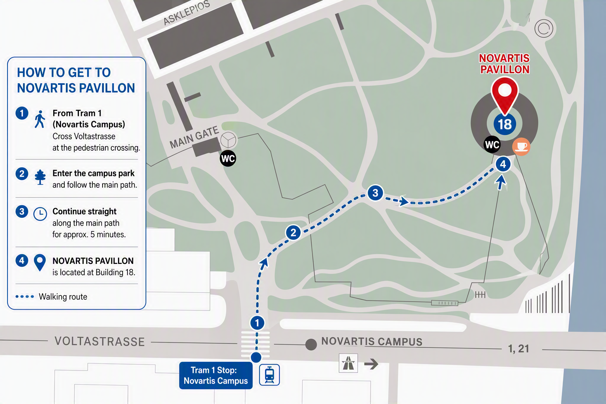
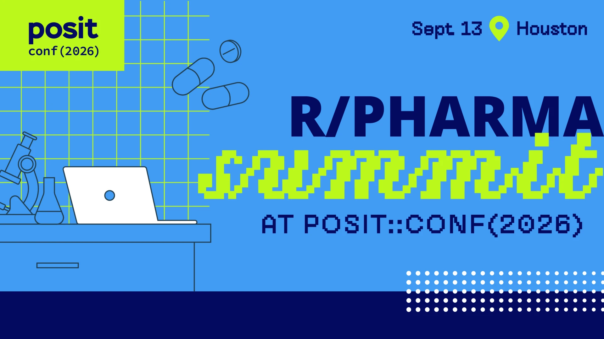
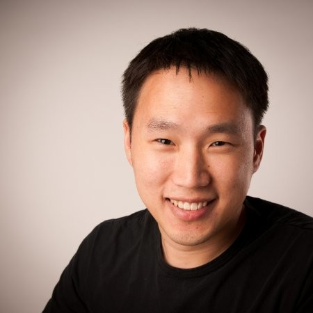
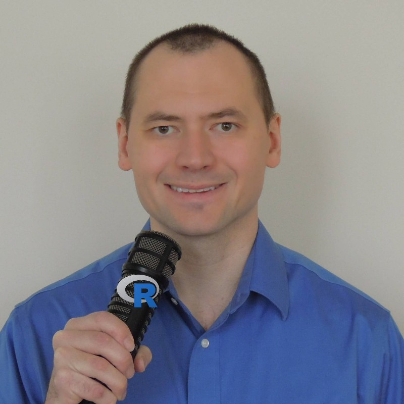
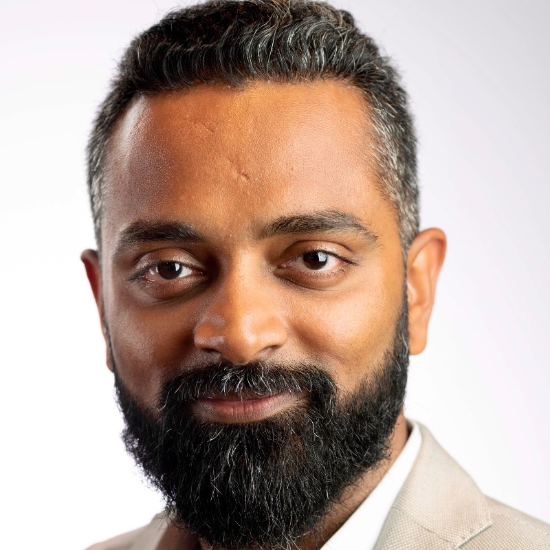
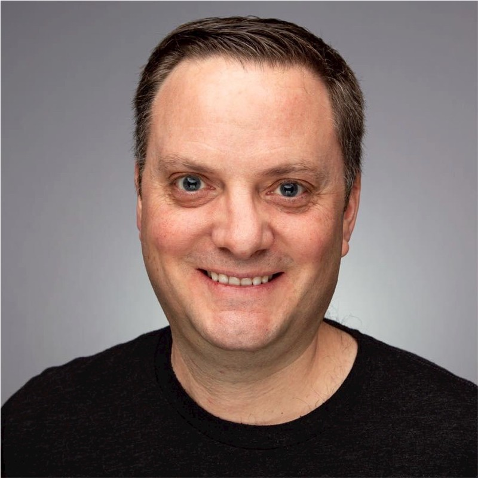

```{=html}
<div class="hero-banner">
  
  <h1 class="hero-title">R/Pharma Summits 2026</h1>
  <p class="hero-subtitle">Two in-person events for the pharma open-source community</p>
  <div class="hero-dates">
    <a class="hero-date-pill" href="#us-summit-september-13-houston">🇺🇸 Go to US Summit · Sept 13, Houston</a>
    <span class="hero-sep">·</span>
    <a class="hero-date-pill eu" href="#eu-summit-october-5-basel">🇨🇭 Go to EU Summit · Oct 5, Basel</a>
  </div>
  <p class="hero-countdown">
    <span id="countdown-us">Houston —</span>
    <span class="hero-sep">·</span>
    <span id="countdown-eu">Basel —</span>
  </p>
</div>

<div class="marquee">
  <div class="marquee-track">
    <span>OPEN SOURCE IN PHARMA</span><span class="dot">•</span>
    <span>AI &amp; REPRODUCIBILITY</span><span class="dot">•</span>
    <span>HOUSTON</span><span class="dot">•</span>
    <span>BASEL</span><span class="dot">•</span>
    <span>ROUNDTABLE DISCUSSIONS</span><span class="dot">•</span>
    <span>OPEN SOURCE IN PHARMA</span><span class="dot">•</span>
    <span>AI &amp; REPRODUCIBILITY</span><span class="dot">•</span>
    <span>HOUSTON</span><span class="dot">•</span>
    <span>BASEL</span><span class="dot">•</span>
    <span>ROUNDTABLE DISCUSSIONS</span><span class="dot">•</span>
  </div>
</div>

<div class="contact-banner reveal">
  ❓ Have a question about the summits, workshops, or virtual R/Pharma? <a href="https://rinpharma.com/contact.html">Ask here →</a>
</div>

<div class="stats-bar reveal">
  <div class="stat">
    <span class="stat-num">2</span>
    <span class="stat-label">Summits — US &amp; EU</span>
  </div>
  <div class="stat">
    <span class="stat-num stat-word">4th Annual</span>
    <span class="stat-label">R/Pharma Summit Series — an intimate gathering of change leaders, Posit engineers &amp; open-source pioneers</span>
  </div>
  <div class="stat">
    <span class="stat-num">1</span>
    <span class="stat-label">Global Community</span>
  </div>
</div>

<div class="event-cards reveal">

  <div class="event-card">
    <span class="event-tag">US Summit</span>
    <h3>🇺🇸 September 13 · Houston</h3>
    <p><a href="https://conf.posit.co/2026/"><strong>Hilton Americas-Houston</strong></a>, Houston, TX</p>
    <p>The day before <a href="https://conf.posit.co/2026/">posit::conf(2026)</a> workshops begin. A full-day roundtable bringing together 80–100 pharma leaders and practitioners.</p>
    <hr>
    <p style="font-size:0.84rem;">To attend without a conference pass, contact <a href="mailto:conf@posit.co">conf@posit.co</a></p>
    <p style="font-size:0.84rem;">Want to join the advisory board? <a href="https://rinpharma.com/contact.html">Contact us</a></p>
    <a class="card-link" href="https://conf.posit.co/2026/registration">Register →</a>
  </div>

  <div class="event-card eu">
    <span class="event-tag">EU Summit</span>
    <h3>🇨🇭 October 5 · Basel</h3>
    <p><a href="https://www.campus.novartis.com/en/novartis-pavillon"><strong>Novartis Pavilion</strong></a>, St. Johanns-Hafen-Weg 5, Novartis Campus, Basel, Switzerland</p>
    <p>A smaller, focused event — capacity is limited.</p>
    <hr>
    <p><strong>Event Full</strong> — this summit is fully booked.</p>
    <p style="margin-top:0.5rem;font-size:0.84rem;">If you'd like to attend, join the waitlist and we'll notify you if additional spots become available.</p>
    <a class="card-link" href="https://luma.com/6liw5gw1">Join the Waitlist →</a>
  </div>

</div>

<div class="why-grid reveal">
  <div class="why-tile">
    <div class="why-kicker">LEARN</div>
    <h4>AI, Validation &amp; Regulatory Readiness</h4>
    <p>Deep-dive sessions on reproducibility, governance, and submission-ready open-source workflows.</p>
  </div>
  <div class="why-tile">
    <div class="why-kicker">NETWORK</div>
    <h4>Connect With Pharma Leaders</h4>
    <p>Meet practitioners and decision-makers across CROs and top-tier pharma companies at each summit.</p>
  </div>
  <div class="why-tile">
    <div class="why-kicker">SHAPE THE AGENDA</div>
    <h4>Vote on Roundtable Topics</h4>
    <p>Every roundtable is community-driven — browse, upvote, and pitch topics before the events.</p>
  </div>
</div>
```

---

::: {.section-eyebrow}
SUMMIT DETAILS
:::

# EU Summit — October 5, Basel

::: {.venue-block .reveal}
**[Novartis Pavilion](https://www.campus.novartis.com/en/novartis-pavillon)**  
St. Johanns-Hafen-Weg 5, Novartis Campus · Basel, Switzerland  

[{fig-align="center" width="80%"}](https://rinpharma.com/contact.html)
:::

## Getting to the Novartis Pavilion (Basel)

::: {.callout-important}
Please bring ID and head directly to the pavilion.
:::

{fig-align="center" width="85%"}

- **From EuroAirport Basel (15 min travel time):** Take the Airport Express Bus PTT 50 to Kannenfeldplatz. Change to Tram 1 (direction Dreirosenbrücke) to the Novartis Campus stop.
- **By tram from Bahnhof Basel SBB (15 min travel time):** Take Tram 1 (direction Dreirosenbrücke, platform D) in front of the main station to the Novartis Campus stop.
- **Getting here by bicycle:** There are multiple covered bicycle parking stations around the campus, which campus tenants and visitors are welcome to use.

## Agenda

::: {.agenda-table .reveal}
| Time              | Chair                                         | Description                                                                                                                   |
|-------------------|-----------------------------------------------|-------------------------------------------------------------------------------------------------------------------------------|
| **9:00am**        | *Satish Murthy* (J&J)                         | Intro to day                                                                                                                  |
| **9:15–10:00am**  | *Gregory Chen* (MSD)                          | <span class="tag tag-pharma">SUBMISSIONS</span> *The Analysis Results Standard Revolution — From Static Tables to Living, Machine-Readable Submissions*                       |
| **10:00–11:00am** | *James Black* (Novartis)                      | <span class="tag tag-ai">AI</span> *Validation and QC Reimagined — Trust, Testing, and the AI-Augmented Programmer*                                              |
| **11:00–11:15am** |                                               | Bio-break                                                                                                                     |
| **11:15–12:15pm** | *Aga Rasinksa* (Atorus)                       | <span class="tag tag-ai">AI</span> *AI fireside chat: current status and workflow challenges, operational reality in regulated practice, and the operating model* |
| **12:15–1:30pm**  |                                               | Lunch 🍴 *Lunch & Learn sessions TBC*                                                                                         |
| **1:30–4:00pm**   | *Shannon Haughton* (GSK)                      | <span class="tag tag-roundtable">ROUNDTABLE</span> **Round tables** — Split into 2 × 1hr sessions with short break between. Attendance at each table is flexible.               |
| **4:00–4:45pm**   | *Mahmoud Hallal* (Roche) & Round table chairs | Chairs report back notes, and any planned follow up                                                                           |
| **4:45–5:00pm**   | *Phil Bowsher* (Posit)                        | Wrap up                                                                                                                       |
| **5:00–6:30pm**   | Posit Team                                    | 🍸 Social event — Posit Sponsored Apéro on-site at the Novartis Pavilion |
:::

## Hotel

::: {.callout-note}
There's no hotel block for this summit — most attendees are local to the area. Note that **BiotechX Europe** is also in Basel around this time, so we recommend booking your hotel early if you're traveling in.
:::

---

::: {.section-eyebrow}
SUMMIT DETAILS
:::

# US Summit — September 13, Houston

::: {.venue-block .reveal}
**[Hilton Americas-Houston](https://conf.posit.co/2026/)**  
Houston, Texas, USA  
*The day before [posit::conf(2026)](https://conf.posit.co/2026/) workshops begin.*

[{fig-align="center" width="80%"}](https://conf.posit.co/2026/registration)
:::

## Getting to Room 335 A/B/C (Houston)

::: {.callout-important}
Room 335 A/B/C is on the 3rd floor — the same floor as the main posit::conf(2026) sessions. Look for the R/Pharma sign; Posit wayfinders will be on-site to help guide you.
:::

::: {.draft-notice}
🎉 **Saturday Night Pre-Summit Hangout — Sept 12, ~6:30–8:30pm.** Join us at **The Lobby Bar**, right in the Hilton Americas-Houston. Look for Paulo and Eric, who'll be there early to help get the group settled — walk-ins welcome, no reservation needed.
:::

## Agenda

*A few details below (speakers, exact timing) are still subject to change.*

::: {.draft-notice}
💻 Laptops optional — the day is conversational, not hands-on. 🎥 The day is not being recorded.
:::

**Full day: 9:00am – 5:00pm**

::: {.agenda-table .reveal}
| Time | Chair | Description |
|---|---|---|
| **9:00 – 9:30am** | *Phil Bowsher* (Posit), *Harvey Lieberman* (Novartis) & *Eric Nantz* (Eli Lilly) | Welcome, introductions & kickoff — *Phil Bowsher* (Posit), *Harvey Lieberman* (Novartis) & *Eric Nantz* (Eli Lilly) |
| **9:30 – 10:20am** | *Joe Cheng* (Posit) | <span class="tag tag-ai">REPRODUCIBILITY</span> **The State of Regulatory Reproducibility** — *Joe Cheng* (Posit) on the state of reproducibility with R in regulated submissions: why Agency reviewers are asking harder questions, and the best practices that keep R code reviewable and trustworthy as coding practices continue to evolve with updates and AI |
| **10:20 – 10:30am** | | Break |
| **10:30 – 11:20am** | *Eric Nantz* (Eli Lilly), *Dilip Raghunathan* (Regeneron) & *Mike K Smith* (Pfizer) | <span class="tag tag-pharma">PHARMA AI</span> **Pharma AI in Practice** — 15-minute lightning talks from *Eric Nantz* (Eli Lilly), *Dilip Raghunathan* (Regeneron), and *Mike K Smith* (Pfizer) on what open source and AI actually look like day-to-day inside a pharma company, followed by a 10–15 minute Q&A panel with all three |
| **11:30am – 12:30pm** | *Dror Berel* & *Eli Alexander Miller* (Atorus Research) | Lunch presentation & networking — proposals from *Dror Berel* (Biostatistics R Developer, Shiny/Teal) on Pharmaverse/Teal &amp; the public Teal Gallery Demos, and *Eli Alexander Miller* (Atorus Research) previewing [R Consortium Submissions WG Pilot 8](https://rconsortium.github.io/submissions-wg/) — a proposal to demonstrate responsible, auditable use of AI agents in the submissions pipeline, building on Pilots 1–7 *(20 min each, pending confirmation)* |
| **12:30 – 12:40pm** | | Break |
| **12:40 – 1:25pm** | *Benjamin Arancibia* (GSK), *Shannon Pileggi* (PCCTC), *Daniel Woodie* (Eli Lilly) & 1–2 more TBD | <span class="tag tag-panel">LIVE Q&A</span> **Open Floor — Live Executive Q&A** — a panel featuring *Benjamin Arancibia* (GSK), *Shannon Pileggi* (Prostate Cancer Clinical Trials Consortium), *Daniel Woodie* (Eli Lilly) and a few more panelists still being confirmed *(45 min)* |
| **1:25 – 2:25pm** | | <span class="tag tag-roundtable">ROUNDTABLE</span> **[Roundtable discussions](#us-summit-roundtable-topics)** — Session 1 *(see the finalized topics below)* |
| **2:25 – 2:40pm** | | Break |
| **2:40 – 3:40pm** | | <span class="tag tag-roundtable">ROUNDTABLE</span> **[Roundtable discussions](#us-summit-roundtable-topics)** — Session 2 |
| **3:40 – 4:40pm** | Round table chairs | Roundtable summaries presented by session chairs |
| **4:40 – 5:00pm** | | Closing remarks |
| **6:00pm** | WU Consulting Group | 🍸 **Evening Mixer** — hosted by WU Consulting Group at *Reserve 101* (6-min walk from the hotel) |
:::

::: {.draft-notice}
🙋 **We need volunteer chairs!** Each table needs a chair to guide the conversation and take notes to report back. If you'd like to volunteer for one of the six roundtables (details further down the page), [let us know here](https://rinpharma.com/contact.html) — we'll follow up to confirm.
:::

### Featured Speakers

```{=html}
<div class="speaker-row reveal">
  <div class="speaker-card">
    
    <div class="speaker-info">
      <div class="speaker-name"><a href="https://www.linkedin.com/in/jcheng">Joe Cheng</a></div>
      <div class="speaker-role">CTO, Posit PBC</div>
    </div>
  </div>
  <div class="speaker-card">
    
    <div class="speaker-info">
      <div class="speaker-name"><a href="https://www.linkedin.com/in/eric-nantz-6621617/">Eric Nantz</a></div>
      <div class="speaker-role">Director, Eli Lilly</div>
    </div>
  </div>
  <div class="speaker-card">
    
    <div class="speaker-info">
      <div class="speaker-name"><a href="https://www.linkedin.com/in/dilipraghunathan">Dilip Raghunathan</a></div>
      <div class="speaker-role">Regeneron</div>
    </div>
  </div>
  <div class="speaker-card">
    
    <div class="speaker-info">
      <div class="speaker-name"><a href="https://www.linkedin.com/in/mikeksmith/">Mike K Smith</a></div>
      <div class="speaker-role">Senior Director, Pfizer</div>
    </div>
  </div>
</div>
```

::: {.mixer-block .reveal}
🎤 **Open Floor — Live Executive Q&A**

Attendees submit written questions throughout the morning; a panel — including *Benjamin Arancibia* (GSK), *Shannon Pileggi* (Prostate Cancer Clinical Trials Consortium), and *Daniel Woodie* (Eli Lilly), with a few more panelists still being confirmed — answers them live and unscripted, a fast-paced way to surface the topics the room cares about most.
:::

::: {.mixer-block .reveal}
🍸 **Evening Mixer — 6:00pm**

Following a well-received happy hour last year, we're doing it again — join us for drinks at **Reserve 101**, a classy cocktail & whiskey bar just a 6-minute walk from the hotel (1201 Caroline St). Given our group size, expect a partial or full venue buyout. Questions for the venue: (713) 480-1579.

```{=html}
<div class="host-badge">
  
  <span>Hosted by <a href="https://wuconsulting.com/">WU Consulting Group</a></span>
</div>
```
:::

## Workshops

Looking for a workshop to take at posit::conf while you're in Houston? You're in luck — two R/Pharma-relevant sessions run **Monday, September 14**:

- **Modern Clinical Reporting in R with the Pharmaverse** — end-to-end clinical reporting (SDTM, ADaM, TLGs, ARDs) for clinical programmers & biostatisticians
- **Administering & Orchestrating Next-Gen Statistical Environments** — AI-integrated, GxP-compliant infrastructure, co-hosted by Pfizer & Posit

## Hotel

::: {.callout-note}
🏨 The Summit is held at the **Hilton Americas-Houston** — the same hotel hosting posit::conf(2026) itself. In the heart of downtown, it offers sophisticated event spaces, upscale amenities, skyline views, and easy access to the city's dining and entertainment.  
👉 [Book your room online](https://book.passkey.com/gt/220989671?gtid=6c4cdb47ca88466ccf695ae6624a43ea)
:::

---

# US Summit Roundtable Topics

The topics below were finalized from the community's proposals in [GitHub Discussions](https://github.com/rinpharma/rinpharma-summit-2026/discussions/categories/round-table-idea) — thank you to everyone who proposed, upvoted, and commented. AI came up constantly across the proposals, so rather than splitting it thin across every table, we grouped it into two focused roundtables and kept the rest of the agenda open to the other topics the community cared about most.

::: {.draft-notice}
📌 **You can pick only one AI-focused table across your two rounds.** There are two rounds and six tables — two of them are AI-focused (Trust & Governance, and AI Operations). Since AI is popular, we're asking each attendee to choose at most one of the two AI tables so both stay focused and the other four topics get a fair mix of participants.
:::

```{=html}
<div class="topics-grid reveal">

  <div class="topic-card">
    <span class="tag tag-ai">AI GOVERNANCE</span>
    <h4>Trust, Safeguards &amp; Governance for Agentic AI</h4>
    <p>As agentic AI moves into GxP-regulated workflows, teams need concrete patterns for trust, safeguards, and governance before deploying these tools in the creation or QC of GxP study code. This table tackles managing hallucinations and maintaining accountability, how to ground agents with the right context and guardrails, and how to evaluate whether AI-generated R code is actually readable and trustworthy — not just correct. The goal is a shared, practical view of what "trustworthy agentic AI" looks like in pharma.</p>
  </div>

  <div class="topic-card">
    <span class="tag tag-ai">AI OPERATIONS</span>
    <h4>AI in Practice: Automation, Cost &amp; Skills</h4>
    <p>Beyond governance, teams are wrestling with practical questions: when deterministic automation beats AI-driven automation, how to benchmark agents and manage token cost as a proxy for spend (including where smaller, local, or open-weight models hold up just fine), and what IDE setups and upskilling paths actually work in a GxP-related context. This roundtable is about the operational side of AI adoption — cost, tooling, and training — comparing what's genuinely working today. We're glad to confirm <a href="https://trustedminiagents.dev/">Will L (trustedminiagents.dev)</a> is joining to help ground the conversation in evaluating and benchmarking agent behavior in practice.</p>
  </div>

  <div class="topic-card env">
    <span class="tag tag-env">ENVIRONMENTS</span>
    <h4>Reproducible Environments &amp; Package Provisioning</h4>
    <p>Does renv make sense inside a Secure Computing Environment (SCE), and what does best-practice R package provisioning actually look like for GxP analyses? As more people bring AI and Python workloads onto shared SCEs, this table also digs into the operational side — how to scale infrastructure like Workbench to meet demand, and whether that demand is even the right use of AI. Attendees will leave with a clearer view of the options, and their limitations, for reproducible R environments in regulated pharma.</p>
  </div>

  <div class="topic-card pharma">
    <span class="tag tag-pharma">REGULATORY</span>
    <h4>Open Source in Regulatory Submissions &amp; Validation</h4>
    <p>Are the industry's long-standing concerns about using open source like R in regulatory filings actually solved heading into 2026 — including where hybrid submissions and ADRG/ADaM inclusion of R code stand today? Drawing on work from CAMIS, pharmaverse, and the R Consortium's submissions working group, this session builds a shared view of agency appetite, reviewer familiarity with R, and confidence in R-based outputs. A dedicated working-group update will also cover the latest on hybrid submissions, SCE considerations, and QC checking of R AI-augmented outputs, so expect input from people who have navigated real submissions.</p>
  </div>

  <div class="topic-card standards">
    <span class="tag tag-roundtable">STANDARDS</span>
    <h4>The Future of Analysis Results Standards (ARD/ARS)</h4>
    <p>This is the community's most-discussed topic on GitHub — the architecture of parameterizable reporting and the case for standardized analysis results in a multi-technology, rapidly changing landscape. The roundtable digs into what a durable ARD/ARS standard needs to look like to survive shifting tech stacks, tooling, and the upcoming CDISC v2 migration. Given the interest already shown online, expect this table to be one of the most heavily attended.</p>
  </div>

  <div class="topic-card adoption">
    <span class="tag tag-panel">ADOPTION</span>
    <h4>Driving Adoption Beyond the Early Adopters</h4>
    <p>Most of us have lived this: "my colleagues still use Excel — now what?" This roundtable tackles the long tail of adoption — the change management behind org-wide migrations to open source and AI, and the judgment calls involved in bringing skeptical or resource-constrained colleagues along. It's a conversation about people and process as much as technology.</p>
  </div>

</div>
```

---

::: {.section-eyebrow}
REGISTER
:::

# Registration

::: {.callout-note}
Register via [posit::conf(2026)](https://conf.posit.co/2026/) or contact [conf@posit.co](mailto:conf@posit.co) to attend without a full conference pass.

👉 [conf.posit.co/2026/registration](https://conf.posit.co/2026/registration)

Want to join the advisory board and help shape the event?  
👉 [Contact us here](https://rinpharma.com/contact.html)
:::

---

::: {.section-eyebrow}
GET INVOLVED
:::

# Roundtable Discussions

The roundtable topics feed into **both** summits and are shaped openly by the community. Please get involved before the events.

::: {.callout-important}
## 💬 Help Shape the Agenda — Vote and Comment Now!

All proposed roundtable topics are collected on GitHub Discussions:

👉 **[github.com/rinpharma/rinpharma-summit-2026/discussions](https://github.com/rinpharma/rinpharma-summit-2026/discussions)**

- **Browse** proposed topics
- **Upvote** the ones that matter most to you
- **Comment** to add context or pitch a new topic

*Notes and outcomes from past roundtables are shared at [rinpharma.com/docs/summit/](https://rinpharma.com/docs/summit/).*
:::

---

::: {.section-eyebrow}
OUR STORY
:::

# Background

In 2018 and 2019, **[R in Pharma](https://rinpharma.com/)** was in-person at Harvard University, focused on direct interaction between speakers and guests. Those connections have grown into many exciting areas of open source drug development — and into the summit series shown below. R/Pharma's virtual programming, which grew out of that same 2020–2022 shift, has since become its own large annual event drawing thousands of attendees a year — a great community in its own right, but a different experience from the smaller, face-to-face summits below.

::: {.callout-note}
📺 **R/Pharma Virtual 2026 is a separate event from the summits on this page.** Workshops run **September 28 – October 1** — 25 free workshops spread across timezones around the globe — with presentations on **October 20–21**. [Register for R/Pharma Virtual here](https://events.zoom.us/ev/Ao58QRuKpY_AuvCDVGqF3tiibvbsLw6MKXn7n_PL2vPdHVQnSAuC~AulApVxluxkRoEef4TZ6ozp1uwmnBHGti8cDERG7p01yOGKH0KXFbLhUNw).
:::

```{=html}
<div class="history-timeline reveal">
  <div class="history-item">
    <div class="history-year">2018–19</div>
    <div class="history-place">Harvard University</div>
    <div class="history-desc">In-person origins</div>
  </div>
  <div class="history-item">
    <div class="history-year">2020–22</div>
    <div class="history-place">Virtual</div>
    <div class="history-desc">Continued through the pandemic</div>
  </div>
  <div class="history-item">
    <div class="history-year">2023</div>
    <div class="history-place">Chicago</div>
    <div class="history-desc">posit::conf(2023)</div>
  </div>
  <div class="history-item">
    <div class="history-year">2024</div>
    <div class="history-place">Seattle</div>
    <div class="history-desc">posit::conf(2024)</div>
  </div>
  <div class="history-item">
    <div class="history-year">2025</div>
    <div class="history-place">Atlanta</div>
    <div class="history-desc">posit::conf(2025)</div>
  </div>
  <div class="history-item current">
    <div class="history-year">2026</div>
    <div class="history-place">Houston &amp; Basel</div>
    <div class="history-desc">First dual US/EU summits</div>
  </div>
</div>
```

::: callout-important
In **2026** we're expanding for the first time to **two events** — bringing the R/Pharma Summit to both the US and Europe! 🎉
:::

---

::: {.section-eyebrow}
WHY R/PHARMA
:::

# Purpose

Over the last five years we've seen explosive growth in the use of R, Python, and other open-source technologies across drug development — with an accelerating focus on **AI**.

::: {.pull-quote}
Bringing people into a room to start the conversations that matter.
:::

The R/Pharma Summit provides an **open, collaborative, and inclusive environment** to foster in-person discussions on:

- AI in drug development
- Validated computing environments
- Scalable infrastructure
- Regulatory compliance and submissions

> 🔗 Review the 2023–2025 roundtable summaries:  
> [rinpharma.github.io/roundtables](https://rinpharma.github.io/roundtables/)

---

# Audience

These summits are for you if:

- You are an active contributor to the adoption of data science best practices across drug development
- You sponsor data science codebases
- You are an informatics professional designing and implementing **GxP-conforming** data science platforms
- You are interested in cross-pharma collaboration

---

# Round Table Advisory Board

A mix of 50 people from pharmaceutical companies, CROs, and organizations supporting the advancement of open source for drug development and clinical reporting.

---

# Organising Committee

The following committee organises the EU Summit. The US Summit is organised by a larger group through the non-profit [Open-Source in Pharma](https://opensourceinpharma.com/), including representatives from several large pharmaceutical companies.

```{=html}
<div class="committee-grid reveal">
  <div class="committee-card"><div class="committee-avatar">MM</div><div class="committee-name">Michael Mayer</div><div class="committee-org">Posit</div></div>
  <div class="committee-card"><div class="committee-avatar">AR</div><div class="committee-name">Aga Rasinksa</div><div class="committee-org">Atorus</div></div>
  <div class="committee-card"><div class="committee-avatar">GC</div><div class="committee-name">Gregory Chen</div><div class="committee-org">MSD</div></div>
  <div class="committee-card"><div class="committee-avatar">SH</div><div class="committee-name">Shannon Haughton</div><div class="committee-org">GSK</div></div>
  <div class="committee-card"><div class="committee-avatar">JB</div><div class="committee-name">James Black</div><div class="committee-org">Novartis</div></div>
  <div class="committee-card"><div class="committee-avatar">OD</div><div class="committee-name">Orla Doyle</div><div class="committee-org">Novartis</div></div>
  <div class="committee-card"><div class="committee-avatar">SM</div><div class="committee-name">Satish Murthy</div><div class="committee-org">J&amp;J</div></div>
  <div class="committee-card"><div class="committee-avatar">PB</div><div class="committee-name">Phil Bowsher</div><div class="committee-org">Posit</div></div>
  <div class="committee-card"><div class="committee-avatar">MH</div><div class="committee-name">Mahmoud Hallal</div><div class="committee-org">Roche</div></div>
</div>
```

---

::: {.section-eyebrow}
QUESTIONS
:::

# FAQ

```{=html}
<div class="faq-list reveal">
  <details class="faq-item">
    <summary>What's the difference between the US and EU Summits?</summary>
    <div class="faq-answer">The US Summit (September 13, Houston) runs the day before posit::conf(2026) and brings together roughly 100 pharma leaders and practitioners. The EU Summit (October 5, Basel) is a smaller, invite-style event at the Novartis Pavilion — around 60 attendees, with limited capacity opening for registration in August.</div>
  </details>
  <details class="faq-item">
    <summary>Who should attend?</summary>
    <div class="faq-answer">Anyone actively contributing to open-source adoption in drug development: informatics and biostatistics leaders, GxP platform owners, data science sponsors, and anyone interested in cross-pharma collaboration.</div>
  </details>
  <details class="faq-item">
    <summary>How do I help shape the roundtable agenda?</summary>
    <div class="faq-answer">All roundtable topics — for both summits — are proposed, discussed, and voted on in <a href="https://github.com/rinpharma/rinpharma-summit-2026/discussions">GitHub Discussions</a>. Browse existing topics, upvote the ones you care about, or pitch a new one.</div>
  </details>
  <details class="faq-item">
    <summary>Can I attend both summits?</summary>
    <div class="faq-answer">Yes — the US and EU Summits are independent events with separate registration. Many organizing committee members and community contributors attend both.</div>
  </details>
  <details class="faq-item">
    <summary>What does it cost to attend?</summary>
    <div class="faq-answer">The EU (Basel) Summit is free to attend — it's hosted at the Novartis Pavilion, with Novartis and the organizing committee covering costs as a contributor-run event where organizers travel in to host it; a small number of extra spots may open up beyond the current waitlist. The US Summit has a cost ($599 standalone, or bundled with a posit::conf(2026) pass) since it's held at a commercial hotel (Hilton Americas-Houston) rather than on a pharma company campus — see the registration link above. By contrast, R/Pharma Virtual — including its workshops and conference sessions — is completely free, a one-of-a-kind event made possible by pharma company support.</div>
  </details>
</div>
```

---

# Endorsement

::: {.endorsement-block .reveal}
::: {.endorsement-label}
Endorsed & Supported By
:::

This summit is under the umbrella of **R/Pharma** and **Open Source in Pharma**, supported by pharma partners **Novartis** and **Johnson & Johnson**. The EU event is hosted by **Novartis** and **Posit**.

::: {.endorsement-logos}
[{.endorsement-logo}](https://rinpharma.com/)

[{.endorsement-logo .endorsement-logo-osp}](https://opensourceinpharma.com/)

[{.endorsement-logo}](https://posit.co/)

[{.endorsement-logo}](https://www.novartis.com/)

[{.endorsement-logo}](https://www.jnj.com/)

[{.endorsement-logo}](https://wuconsulting.com/)
:::
:::

---
