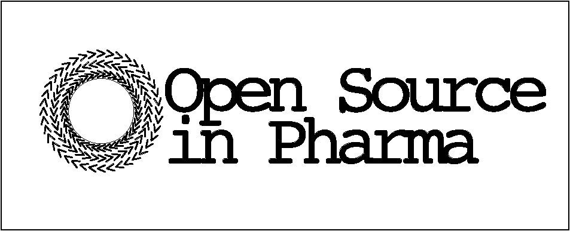
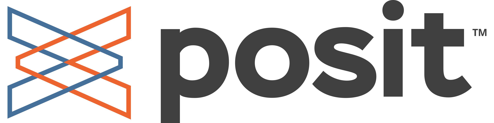

```{=html}
<div class="hero-banner">
  
  <h1 class="hero-title">R/Pharma Summits 2026</h1>
  <p class="hero-subtitle">Two in-person events for the pharma open-source community</p>
  <div class="hero-dates">
    <span class="hero-date-pill">🇺🇸 September 13 &middot; Houston</span>
    <span class="hero-sep">·</span>
    <span class="hero-date-pill">🇨🇭 October 5 &middot; Basel</span>
  </div>
</div>

<div class="event-cards">

  <div class="event-card">
    <span class="event-tag">US Summit</span>
    <h3>🇺🇸 September 13 · Houston</h3>
    <p><strong>Hilton Americas-Houston</strong>, Houston, TX</p>
    <p>The day before posit::conf(2026) workshops begin. A full-day roundtable bringing together 80–100 pharma leaders and practitioners.</p>
    <hr>
    <p><strong>Tickets:</strong> $599 standalone, or as an add-on with a posit::conf(2026) pass.</p>
    <p style="margin-top:0.5rem;font-size:0.84rem;">To attend without a conference pass, contact <a href="mailto:conf@posit.co">conf@posit.co</a></p>
    <p style="font-size:0.84rem;">Want to join the advisory board? <a href="https://rinpharma.com/contact.html">Contact us</a></p>
    <a class="card-link" href="https://conf.posit.co/2026/registration">Register →</a>
  </div>

  <div class="event-card eu">
    <span class="event-tag">EU Summit</span>
    <h3>🇨🇭 October 5 · Basel</h3>
    <p><strong>Novartis Pavilion</strong>, Novartis Campus, Basel, Switzerland</p>
    <p>A smaller, focused event — capacity is limited.</p>
    <hr>
    <p>A limited number of spots open for registration in <strong>August</strong> — we expect them to go quickly.</p>
    <p style="margin-top:0.5rem;font-size:0.84rem;">To request a spot in advance, please get in touch.</p>
    <a class="card-link" href="https://rinpharma.com/contact.html">Request a spot →</a>
  </div>

</div>
```

---

# EU Summit — October 5, Basel

::: callout-important
**Novartis Pavilion**  
Novartis Campus · Basel, Switzerland  
Meeting Room: **TBC**

{fig-align="center" width="80%"}
:::

## Agenda

::: {.agenda-table}
| Time              | Chair                                         | Description                                                                                                                   |
|-------------------|-----------------------------------------------|-------------------------------------------------------------------------------------------------------------------------------|
| **9:00am**        | *Satish Murthy* (J&J)                         | Intro to day                                                                                                                  |
| **9:15–10:00am**  | *Gregory Chen* (MSD)                          | *The Analysis Results Standard Revolution — From Static Tables to Living, Machine-Readable Submissions*                       |
| **10:00–11:00am** | *James Black* (Novartis)                      | *Validation and QC Reimagined — Trust, Testing, and the AI-Augmented Programmer*                                              |
| **11:00–11:15am** |                                               | Bio-break                                                                                                                     |
| **11:15–12:15pm** | *Aga Rasinksa* (Atorus)                       | *AI fireside chat: current status and workflow challenges, operational reality in regulated practice, and the operating model* |
| **12:15–1:30pm**  |                                               | Lunch 🍴 *Lunch & Learn sessions TBC*                                                                                         |
| **1:30–4:00pm**   | *Shannon Haughton* (GSK)                      | **Round tables** — Split into 2 × 1hr sessions with short break between. Attendance at each table is flexible.               |
| **4:00–4:45pm**   | *Mahmoud Hallal* (Roche) & Round table chairs | Chairs report back notes, and any planned follow up                                                                           |
| **4:45–5:00pm**   | *Phil Bowsher* (Posit)                        | Wrap up                                                                                                                       |
| **6:00–8:00pm**   | Posit Team                                    | Social event — *Posit Sponsored Apero on-site*                                                                                |
:::

---

# Roundtable Discussions

The roundtable topics feed into **both** summits and are shaped openly by the community. Please get involved before the events.

::: {.callout-important}
## 💬 Help Shape the Agenda — Vote and Comment Now!

All proposed roundtable topics are collected on GitHub Discussions:

👉 **[github.com/rinpharma/rinpharma-summit-2026/discussions](https://github.com/rinpharma/rinpharma-summit-2026/discussions)**

- **Browse** proposed topics
- **Upvote** the ones that matter most to you
- **Comment** to add context or pitch a new topic

*Notes and outcomes from past roundtables are shared at [rinpharma.com/docs/summit/](https://rinpharma.com/docs/summit/).*
:::

---

# Background

In 2018 and 2019, **R in Pharma** was in-person at Harvard University, focused on direct interaction between speakers and guests. Those connections have grown into many exciting areas of open source drug development.

- In **2023** we partnered with *Posit*, hosting a session at posit::conf(2023) in Chicago.
- In **2024**, the session continued at posit::conf(2024) in Seattle.
- In **2025**, we hosted a summit at posit::conf(2025) in Atlanta.

::: callout-important
In **2026** we're expanding for the first time to **two events** — bringing the R/Pharma Summit to both the US and Europe! 🎉
:::

---

# Purpose

Over the last five years we've seen explosive growth in the use of R, Python, and other open-source technologies across drug development — with an accelerating focus on **AI**.

The R/Pharma Summit provides an **open, collaborative, and inclusive environment** to foster in-person discussions on:

- AI in drug development
- Validated computing environments
- Scalable infrastructure
- Regulatory compliance and submissions

> 🔗 Review the 2023–2025 roundtable summaries:  
> [rinpharma.github.io/roundtables](https://rinpharma.github.io/roundtables/)

---

# Audience

These summits are for you if:

- You are an active contributor to the adoption of data science best practices across drug development
- You sponsor data science codebases
- You are an informatics professional designing and implementing **GxP-conforming** data science platforms
- You are interested in cross-pharma collaboration

---

# Round Table Advisory Board

A mix of 50 people from pharmaceutical companies, CROs, and organizations supporting the advancement of open source for drug development and clinical reporting.

---

# Organising Committee

The following committee organises the EU Summit. The US Summit is organised by a larger group through the non-profit Open-Source in Pharma, including representatives from several large pharmaceutical companies.

- **Michael Mayer** (Posit)
- **Aga Rasinksa** (Atorus)
- **Gregory Chen** (MSD)
- **Shannon Haughton** (GSK)
- **James Black** (Novartis)
- **Orla Doyle** (Novartis)
- **Satish Murthy** (J&J)
- **Phil Bowsher** (Posit)
- **Mahmoud Hallal** (Roche)

---

# Endorsement

::: {.endorsement-block}
::: {.endorsement-label}
Endorsed & Supported By
:::

This summit is under the umbrella of **R/Pharma** and **Open Source in Pharma**. The EU event is hosted by **Novartis** and **Posit**.

::: {.endorsement-logos}
[{.endorsement-logo}](https://rinpharma.com/)

[{.endorsement-logo .endorsement-logo-osp}](https://opensourceinpharma.com/)

[{.endorsement-logo}](https://posit.co/)
:::
:::

---
